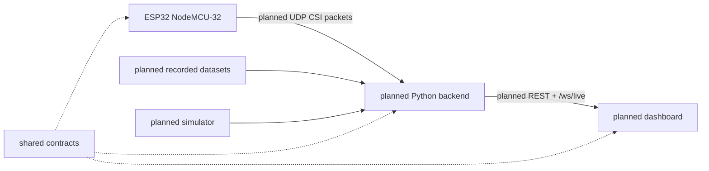

# EchoSense Agent Guide

This repository is an early scaffold for EchoSense, a clean-room, local-first Wi-Fi CSI sensing project. It currently contains planning documents and placeholder folders, not a runnable implementation.

## Current Truth

- Firmware is not implemented.
- Backend runtime code is not implemented.
- Frontend code is not implemented.
- ML models are not implemented.
- The only backend subfolder is `backend/simulator/`, and it currently contains a README only.
- Existing docs define the intended architecture, roadmap, data flow, and clean-room constraints.

## Project Goal

EchoSense aims to use one ESP32 NodeMCU-32, a Wi-Fi router, and a laptop backend to validate Channel State Information (CSI) capture, stream packets locally, record/replay sessions, and eventually support room-level motion and occupancy detection.

EchoSense intentionally avoids cameras, wearables, identity tracking, cloud inference as a requirement, heart-rate detection, respiration detection, DensePose, skeleton estimation, and multi-person localization.

## Clean-Room Boundary

EchoSense is inspired by high-level architecture patterns from RuView, but it must remain an independent implementation.

Do not copy external code, assets, CSS, diagrams, protocol definitions, API names, firmware, model code, branding, screenshots, or implementation details. Keep EchoSense-specific names, contracts, packet formats, APIs, and UI language.

## Safe Next Steps

1. Define minimal shared contracts in `shared/protocol/`, `shared/schemas/`, and `shared/constants/`.
2. Implement only the Hardware Validation path first:
   - ESP32 CSI capture.
   - UDP packet transmission.
   - Laptop packet reception.
   - Packet-rate logging.
   - Raw CSI parsing.
3. Record a first validation dataset after parsing works.
4. Add replay and simulator support only after the live packet contract is defined.
5. Delay motion detection, occupancy detection, ML, and dashboard polish until hardware validation succeeds.

## Architecture Summary

## Coding Conventions Already Implied

- Keep the backend as one Python application until there is measured need for services.
- Use shared protocol/schema/constant definitions instead of duplicating strings.
- Use structured logging rather than `print()` diagnostics.
- Bind local services to `127.0.0.1` by default.
- Treat UDP packets as untrusted input.
- Use replay mode so frontend and algorithms can be tested without hardware.
- Keep simulator packets aligned with the same protocol as firmware.

## Documentation Map

- [Architecture](docs/Architecture.md)
- [Current Status](docs/CurrentStatus.md)
- [Roadmap](docs/Roadmap.md)
- [Folder Structure](docs/FolderStructure.md)
- [Design Decisions](docs/DesignDecisions.md)
- [Setup](docs/Setup.md)
- [Known Issues](docs/KnownIssues.md)
- [API](docs/API.md)
- [Database](docs/Database.md)
- [Hardware](docs/Hardware.md)
- [Development Guide](docs/DevelopmentGuide.md)

## Important Assumptions

- The intended backend language is Python because the current docs specify a local Python backend.
- The intended frontend includes a browser dashboard and future Three.js visualization.
- The intended hardware is ESP32 NodeMCU-32 because it is named throughout the existing docs.
- No concrete packet format, schema file, API handler, database, firmware, frontend app, or model exists yet.

