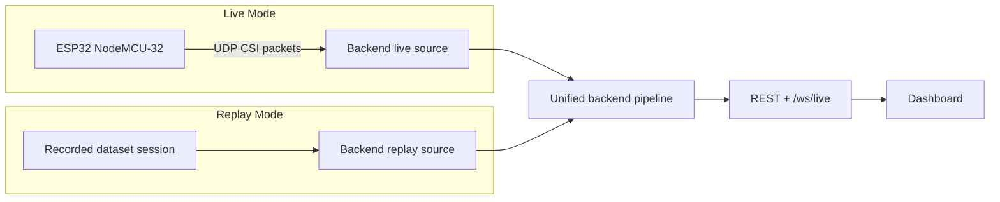
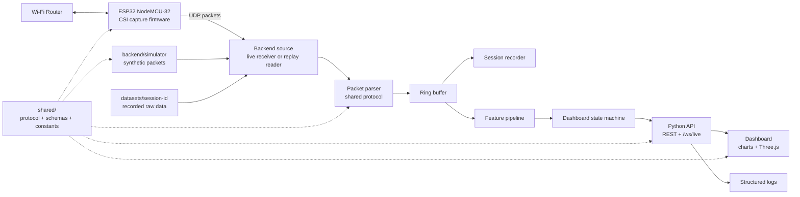
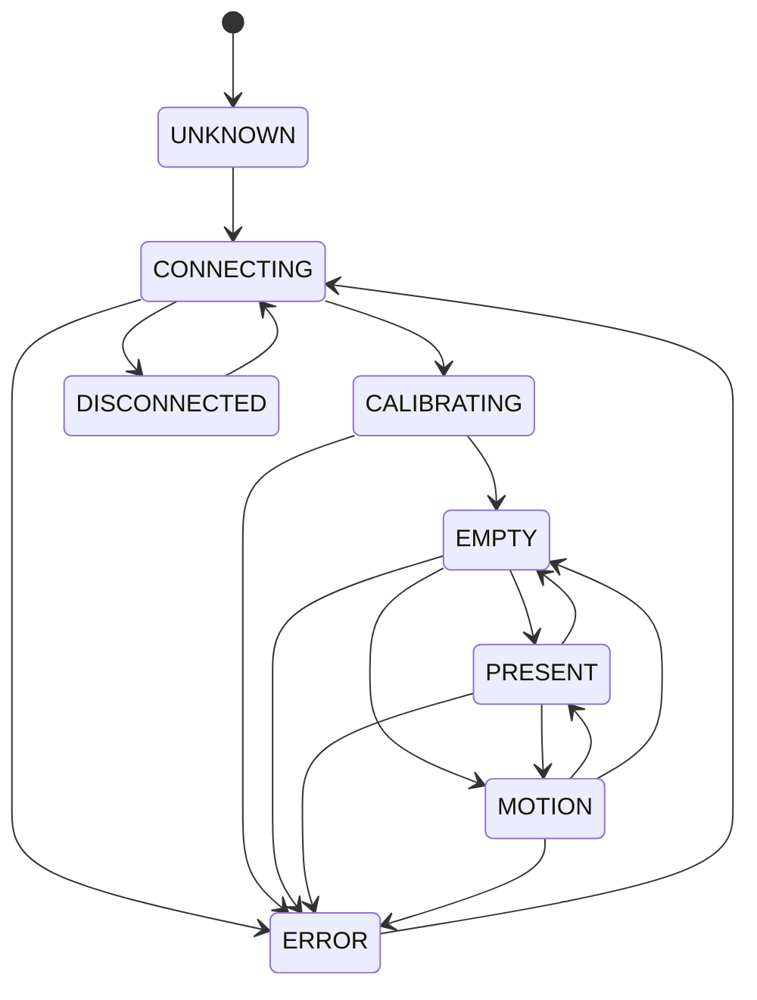

# EchoSense Architecture

EchoSense is a clean-room, open-source Wi-Fi sensing project inspired by high-level architecture patterns observed in the local RuView repository. The review was limited to architecture, folder organization, communication boundaries, CSI data flow, dashboard transport, and API structure. EchoSense must not copy RuView code, assets, branding, UI design, CSS, diagrams, protocol definitions, API names, model implementation, firmware implementation, or other implementation details.

EchoSense v1 targets one ESP32 NodeMCU-32, one laptop running Python, and a Wi-Fi router. The project focuses on Wi-Fi CSI collection, hardware validation, live/replay data flow, dataset recording, live CSI visualization, motion detection, occupancy detection, and a modern Three.js dashboard. Heart rate, respiration, DensePose, human skeleton estimation, identity tracking, and multi-person localization are intentionally out of scope.

## Architecture Goals

- Validate the ESP32 NodeMCU-32 CSI path before building detection features.
- Keep firmware small and focused on CSI capture and UDP transport.
- Keep the backend as one Python application with clear internal modules.
- Avoid premature microservices and unnecessary abstractions.
- Use shared EchoSense protocol definitions instead of duplicated packet/message constants.
- Make replay mode behave exactly like live mode from the frontend perspective.
- Use structured logging instead of `print()` for runtime diagnostics.
- Preserve privacy by processing locally and avoiding cameras, cloud services, and identity features.

## Clean-Room Boundary

EchoSense can learn from design patterns, but implementation must remain independent:

- Define EchoSense-specific packet formats, schemas, names, routes, state names, and UI language.
- Do not copy external source code, assets, CSS, screenshots, diagrams, protocol constants, API names, model code, branding, or implementation details.
- Treat RuView as architectural inspiration only.
- Keep claims limited to what EchoSense validates with its own hardware and datasets.

## Project Structure

```text
EchoSense/
  README.md
  TODO.md
  docs/
    architecture.md
    system-design.md
    data-flow.md
    roadmap.md
  shared/
    README.md
    protocol/
      README.md
    schemas/
      README.md
    constants/
      README.md
  firmware/
    # Future ESP32 NodeMCU-32 firmware
  backend/
    simulator/
      README.md
    # Future single Python backend application
  frontend/
    # Future dashboard
  datasets/
    README.md
    # Future versioned session folders
  logs/
    README.md
    # Future structured runtime logs
  models/
    # Future lightweight local models
```

## Shared Module

The top-level `shared/` directory is the source of truth for cross-layer contracts. Firmware, backend, simulator, replay mode, and frontend should depend on shared definitions instead of duplicating constants.

| Area | Purpose |
| --- | --- |
| `shared/protocol/` | UDP packet format, WebSocket message envelope, REST contract notes, versioning rules |
| `shared/schemas/` | CSI frame schema, dashboard state schema, dataset metadata schema, calibration metadata schema |
| `shared/constants/` | protocol versions, default ports, dashboard state names, WebSocket message type names |

No runtime logic is required in `shared/` yet. The first implementation step should define minimal documented contracts, then each runtime module can consume them.

## Operating Modes

EchoSense supports two modes with the same frontend contract.



From the dashboard's perspective, live and replay mode must be indistinguishable. Both publish the same `/ws/live` message envelope and the same REST state shape. Replay mode lets developers test parsing, visualization, and algorithms without hardware.

## High-Level Architecture



## Module Responsibilities

| Module | Responsibility | v1 scope |
| --- | --- | --- |
| `shared/` | Shared protocol definitions, schemas, constants, common types | Source of truth for packets, message envelopes, dashboard states |
| `firmware/` | Connect to Wi-Fi, enable CSI capture, serialize frames, send UDP packets | Hardware validation first; no detection logic |
| `backend/simulator/` | Generate synthetic CSI packets using the same protocol as firmware | Development scenarios: idle room, small motion, walking, noisy environment |
| `backend/live_source` | Receive UDP packets from ESP32 | Validate source, track packet stats, forward bytes to parser |
| `backend/replay_source` | Read recorded sessions and emit frames like live mode | Same interface as live source |
| `backend/parser` | Convert packet bytes into typed CSI frames | Strict length/version validation and payload caps |
| `backend/processing` | Produce stable feature summaries | Amplitude-first features; phase treated as experimental |
| `backend/state` | Maintain dashboard state machine | `UNKNOWN`, `CONNECTING`, `CALIBRATING`, `EMPTY`, `PRESENT`, `MOTION`, `ERROR`, `DISCONNECTED` |
| `backend/api` | Expose simplified v1 REST and one WebSocket endpoint | `/api/health`, `/api/state`, calibration, recording, `/ws/live` |
| `backend/logging` | Structured backend and event logs | `logs/backend.log`, `logs/events.log` |
| `frontend/` | Render live/replay state from API messages | One WebSocket stream and REST controls |
| `datasets/` | Store versioned CSI sessions | session folders with metadata, raw, and processed files |

## Dashboard State Machine

The frontend should render from explicit states instead of scattered booleans.



## Engineering Standards

Every module should include:

- documentation,
- type hints where applicable,
- configuration,
- structured logging,
- clear interfaces,
- minimal abstractions.

The backend should remain a single Python application with well-defined internal modules. Splitting into services should wait until there is a measured need.
