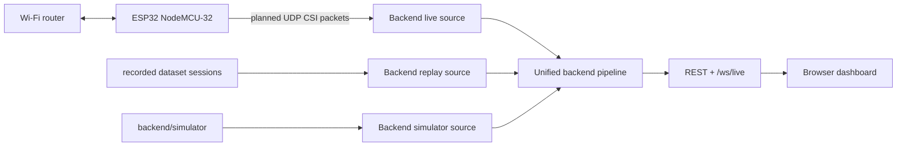
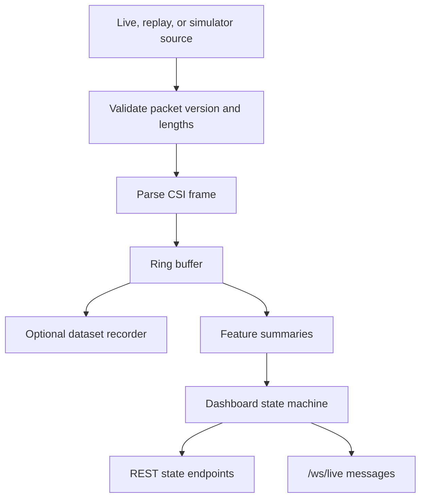
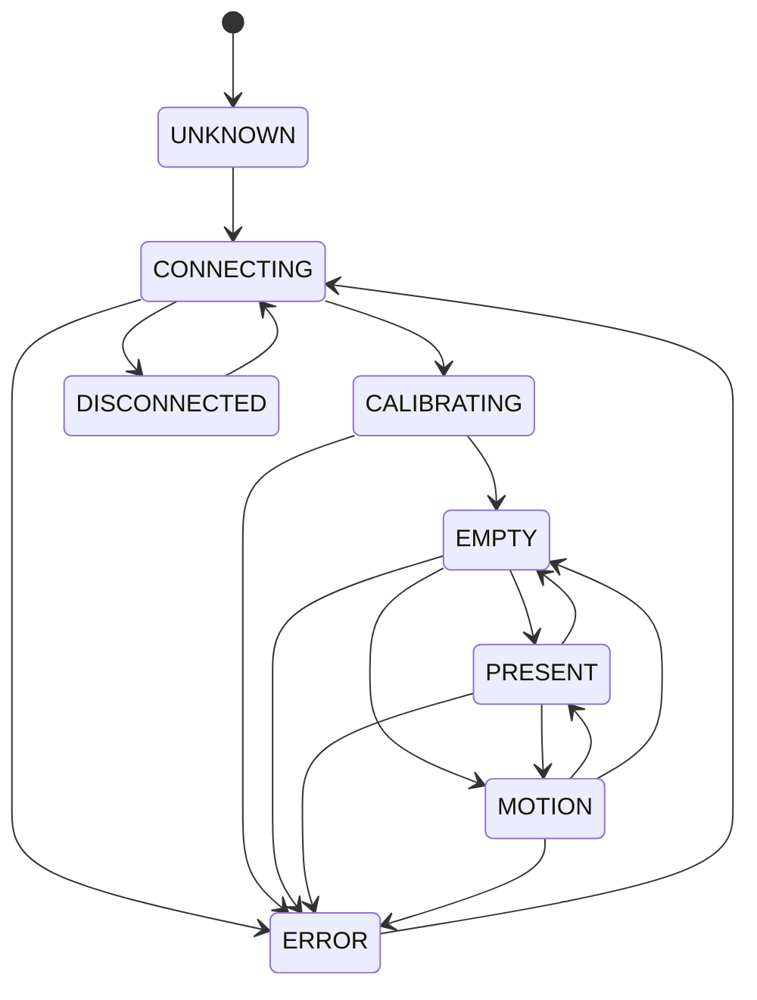

# Architecture

EchoSense is an early-stage local Wi-Fi CSI sensing project. The architecture is currently documented but not implemented.

## Current Implementation Status

| Area | Status |
| --- | --- |
| Firmware | Planned only |
| Backend | Planned only |
| Backend simulator | README placeholder only |
| Frontend | Planned only |
| Shared contracts | README placeholders only |
| Datasets | README placeholder only |
| Logs | README placeholder only |
| Models | Planned only |

## Intended System

EchoSense v1 targets one ESP32 NodeMCU-32, one Wi-Fi router, one laptop running a Python backend, and a browser dashboard. The first milestone is Hardware Validation: prove CSI capture, UDP transmission, packet reception, packet-rate stability, and raw parsing.

## Planned Backend Pipeline

The existing docs specify a single Python backend process with internal modules for receive, replay, parsing, buffering, processing, state, API, recording, and logging. None of those modules exist yet.

## Planned Dashboard States

These states are documented in the existing README and architecture docs but are not yet implemented.

## Module Responsibilities

| Module | Planned responsibility | Current status |
| --- | --- | --- |
| `shared/` | Source of truth for protocol, schemas, constants, common types | Placeholder READMEs |
| `firmware/` | ESP32 Wi-Fi connection, CSI callback, packet serialization, UDP send | Empty folder |
| `backend/simulator/` | Synthetic CSI packet generation for development | README only |
| `backend/live_source` | Receive UDP packets from ESP32 | Not present |
| `backend/replay_source` | Read recorded sessions and emit frames | Not present |
| `backend/parser` | Parse and validate CSI packets | Not present |
| `backend/processing` | Compute feature summaries | Not present |
| `backend/state` | Maintain dashboard state machine | Not present |
| `backend/api` | Serve REST and WebSocket endpoints | Not present |
| `frontend/` | Render live/replay dashboard | Empty folder |
| `datasets/` | Store versioned CSI sessions | README only |
| `logs/` | Store structured runtime logs | README only |
| `models/` | Store future lightweight local models | Empty folder |

## Communication

Planned communication paths:

- ESP32 to backend: UDP packets on the local network.
- Backend to browser: REST control/status endpoints and one WebSocket stream.
- Replay to backend: local dataset files.
- Simulator to backend: synthetic packets using the same shared protocol.

No network services are currently implemented.

## Assumptions

- Backend modules will be Python because the docs repeatedly specify a Python backend.
- Frontend will be browser-based and later include Three.js because the docs specify a dashboard and future Three.js room view.
- Packet and schema contracts must be created before implementation because `shared/` currently contains only placeholders.

