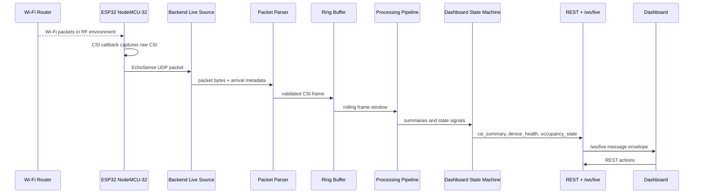
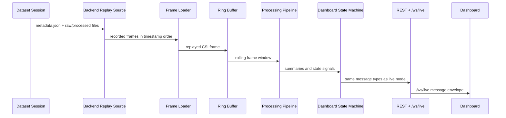
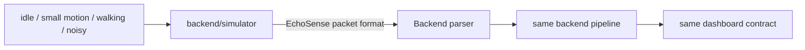
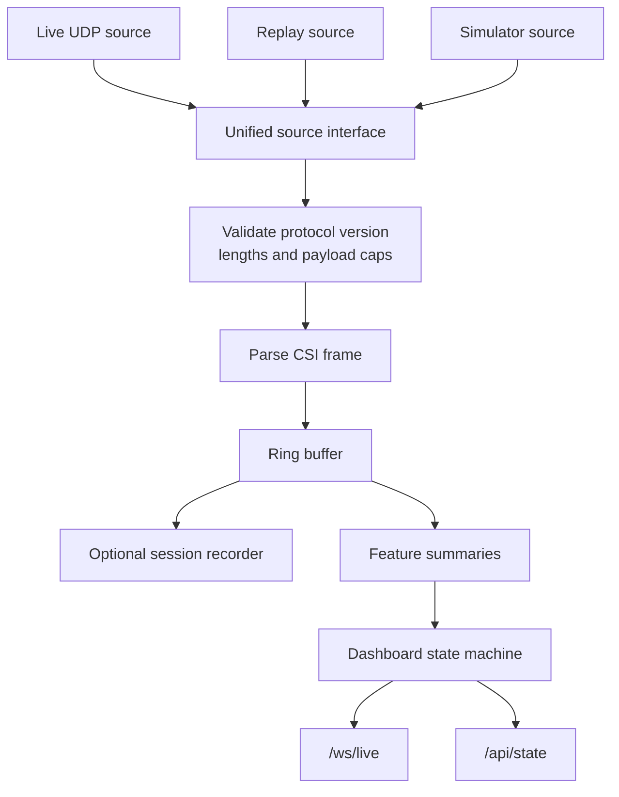
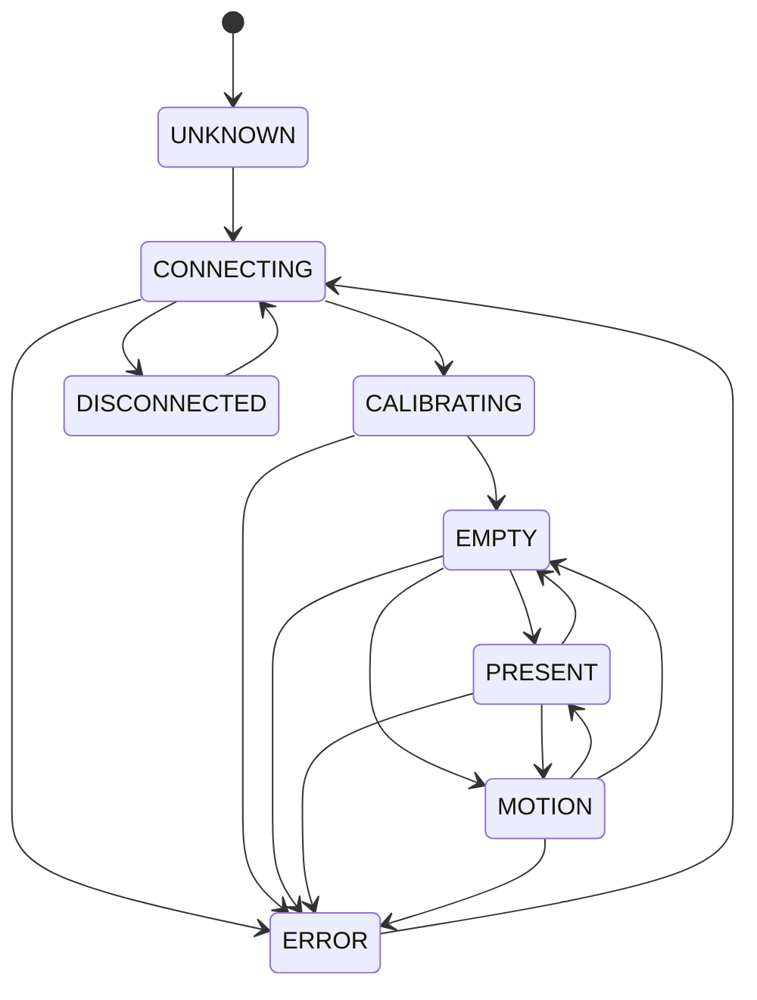
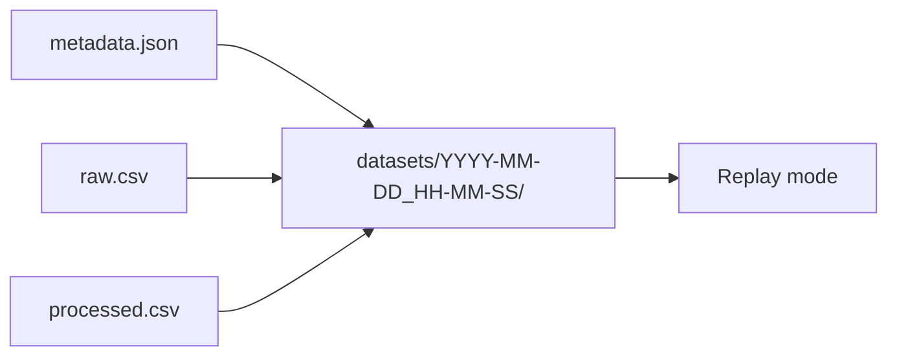
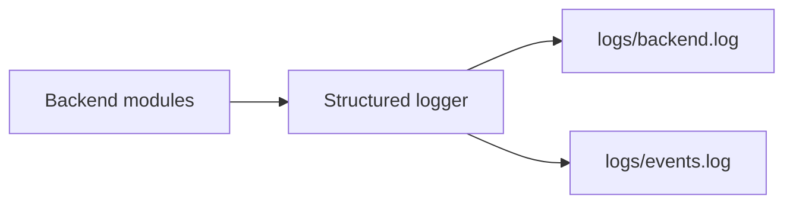

# EchoSense Data Flow

EchoSense has two production-relevant data paths and one development-only path.

- Live mode: ESP32 to UDP to backend to dashboard.
- Replay mode: recorded dataset to backend to dashboard.
- Simulator mode: synthetic packets to backend to dashboard for development only.

The frontend contract must remain the same for all paths: REST control endpoints plus `/ws/live` messages using `{ "type": "...", "payload": { ... } }`.

## Live Mode



## Replay Mode



Replay mode should preserve timing by default, with a future option for faster-than-real-time testing. It must use the same message schema as live mode.

## Simulator Mode

The simulator is a development source that creates synthetic packets matching the shared EchoSense protocol.



Simulator output must be useful for backend and UI development, but it should never be used as evidence for real sensing claims.

## Unified Backend Pipeline



## Hardware Validation Flow

Before motion or occupancy work begins, EchoSense must prove the hardware path:

1. ESP32 NodeMCU-32 captures CSI.
2. ESP32 transmits UDP packets.
3. Laptop receives packets.
4. Packet rate is stable enough for analysis.
5. Raw CSI is parsed successfully.

Only after this milestone should the project proceed to motion detection, occupancy detection, or polished dashboard work.

## Dashboard State Flow



State definitions:

| State | Meaning |
| --- | --- |
| `UNKNOWN` | Backend has not established a source or replay session |
| `CONNECTING` | Backend is waiting for live packets or preparing replay/simulator source |
| `CALIBRATING` | Baseline calibration is running |
| `EMPTY` | Signal resembles calibrated empty-room baseline |
| `PRESENT` | Signal suggests presence without active motion |
| `MOTION` | Motion energy is above threshold |
| `ERROR` | Backend, parser, source, or calibration error |
| `DISCONNECTED` | Live source stopped receiving packets |

## WebSocket Message Flow

All live dashboard messages use one envelope:

```json
{
  "type": "device_health",
  "payload": {
    "source": "live",
    "packet_rate_hz": 20.0,
    "packet_loss": 0,
    "last_seen_ms": 120
  }
}
```

Initial message types:

- `csi_summary`
- `motion_state`
- `device_health`
- `occupancy_state`
- `calibration_status`

The backend should decimate raw CSI before sending it to the browser. The browser should receive UI-friendly summaries unless a debug mode is explicitly enabled.

## Recording Flow



Dataset recording should be available as soon as packet parsing works. This makes later algorithm changes testable without requiring the ESP32 every time.

## Logging Flow



Suggested logged events:

- backend startup and shutdown,
- source mode selected,
- device connected/disconnected,
- packet rate changes,
- packet parse errors,
- calibration start/finish/failure,
- recording start/stop,
- dashboard state transitions,
- warnings and errors.
