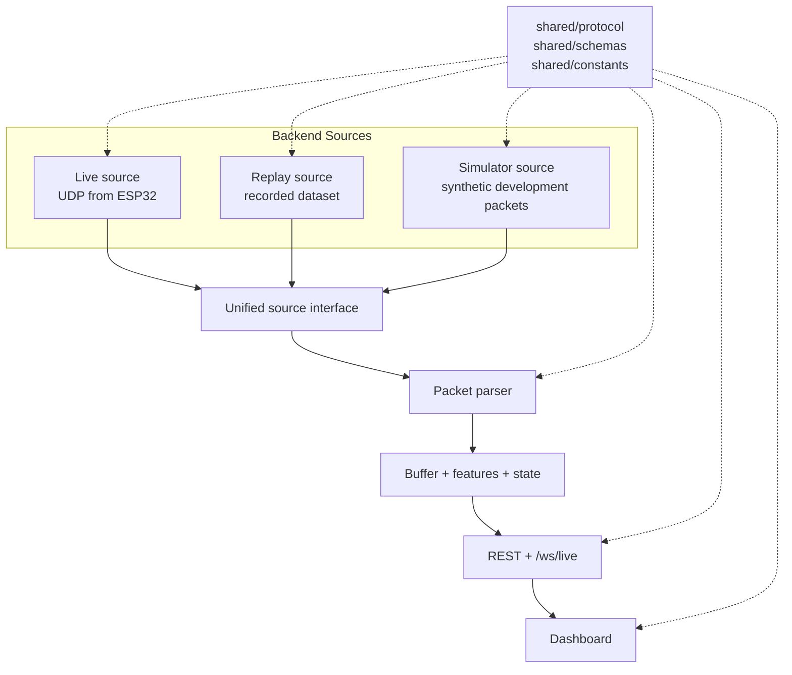

# EchoSense System Design

EchoSense v1 is a local sensing system made of one ESP32 NodeMCU-32, a Wi-Fi router, a Python laptop service, and a browser dashboard. The first priority is hardware validation and trustworthy data flow. Motion and occupancy features should not begin until the ESP32 can capture CSI, send UDP packets, and the laptop can parse them reliably.

## Target Hardware

| Component | Role | Notes |
| --- | --- | --- |
| ESP32 NodeMCU-32 | CSI capture node | Must be validated before feature work; more constrained than ESP32-S3 |
| Wi-Fi router | Network and RF environment | Provides local network path and RF environment |
| Laptop | Backend runtime and dashboard host | Runs one Python app for receive, replay, process, API, recording |
| Browser | User interface | Consumes REST and one WebSocket stream |

## v1 Networking

Version 1 uses a deliberately small network surface.

### REST

| Method | Path | Purpose |
| --- | --- | --- |
| `GET` | `/api/health` | Backend health, version, uptime, logging status |
| `GET` | `/api/state` | Current dashboard state, mode, device stats, recording status |
| `POST` | `/api/calibrate` | Start calibration |
| `POST` | `/api/record/start` | Start recording a versioned dataset session |
| `POST` | `/api/record/stop` | Stop recording the active session |

### WebSocket

One endpoint:

```text
/ws/live
```

Every message must use the same envelope:

```json
{
  "type": "...",
  "payload": {}
}
```

Initial message types:

| Type | Purpose |
| --- | --- |
| `csi_summary` | UI-friendly CSI summary, not full raw stream unless explicitly configured |
| `motion_state` | Motion feature state and confidence |
| `device_health` | packet rate, packet loss, RSSI, last seen, source mode |
| `occupancy_state` | current room state and confidence |
| `calibration_status` | calibration progress, quality, and completion state |

## Live and Replay Sources



Replay mode must use the same backend pipeline and WebSocket envelope as live mode. The dashboard should not need to know whether data came from hardware, replay, or the simulator except for a source label in diagnostics.

## Simulator

`backend/simulator/` is for development only. It should generate synthetic CSI packets that match the EchoSense firmware protocol.

Required scenarios:

- idle room,
- small motion,
- walking,
- noisy environment.

The simulator should never define a second packet format. It should import or follow the same shared protocol definitions that firmware and backend use.

## Structured Logging

Runtime diagnostics should use structured logs, not `print()`.

Planned log files:

| File | Contents |
| --- | --- |
| `logs/backend.log` | startup, config, packet statistics, source mode, device connections, warnings, errors |
| `logs/events.log` | calibration events, recording events, state transitions, operator actions |

Log entries should include timestamps, level, event name, source module, and structured fields such as sequence number, packet rate, session id, state, or error code.

## Dataset Organization

Datasets use versioned session folders, not flat files.

```text
datasets/
  2026-07-03_14-35-21/
    metadata.json
    raw.csv
    processed.csv
```

`metadata.json` should include:

- timestamp,
- firmware version,
- backend version,
- board type,
- router channel,
- sampling rate,
- calibration information,
- source mode,
- protocol version,
- notes about room setup.

`raw.csv` stores raw parsed CSI frames or a documented raw representation. `processed.csv` stores feature summaries and state outputs for replay and evaluation.

## Packet Contract

The exact packet format should be defined in `shared/protocol/` before firmware and simulator implementation. A minimal v1 packet should include:

| Field | Purpose |
| --- | --- |
| magic/version | identify EchoSense packets and protocol version |
| node_id | identify the sender |
| sequence | detect dropped or reordered UDP packets |
| timestamp_ms | device timestamp |
| rssi | signal quality |
| subcarrier_count | payload sizing and validation |
| payload_format | raw I/Q for v1 |
| csi_payload | CSI values |

Keep checksum and compression out of v1 unless testing proves they are needed.

## Security Defaults

- Bind the backend to `127.0.0.1` by default.
- Require explicit configuration before exposing the backend on the LAN.
- Treat UDP packets as untrusted input.
- Validate lengths before parsing payloads.
- Cap packet sizes and WebSocket message sizes.
- Avoid writing Wi-Fi credentials to datasets, logs, or repository files.
- Keep CORS narrow during frontend development.

## NodeMCU-32 Constraints

The NodeMCU-32 may be sufficient for raw CSI capture and UDP streaming, but it is not the right place for heavy processing.

Implications:

- firmware should avoid detection algorithms in v1,
- backend should own parsing, features, replay, and detection,
- phase features should be considered experimental until measured,
- amplitude-based features should be the first stable path,
- hardware validation must complete before the rest of the roadmap proceeds.

## Maintainability Rules

- Prefer one Python backend process with internal modules.
- Use type hints and clear interfaces in backend code.
- Document module responsibilities before implementation.
- Use configuration files or environment variables instead of hardcoded local settings.
- Avoid broad abstractions until two real call sites exist.
- Record data early so changes can be tested against replay sessions.
